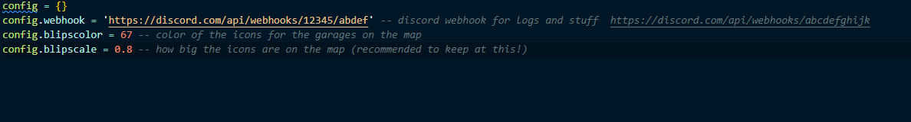

# 🔗 Configuration&#x20;

<figure><figcaption>
This is the config.lua findable in editable/config.lua
</figcaption></figure>

config.webhook = a discord webhook intergration for logs and similar stuff&#x20;

config.blipscolor = the color of the icons on the map for the garages on sim
