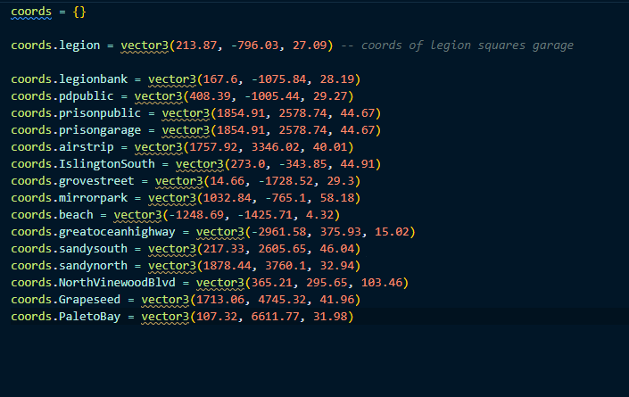

# 🔗 coords

<figure><figcaption>
<strong>this is the coords.lua findable in editable/coords.lua</strong>
</figcaption></figure>

these are the vector3's of the blips & the indication to enter the garage to put there vehicle away or to get a vehicle out&#x20;
